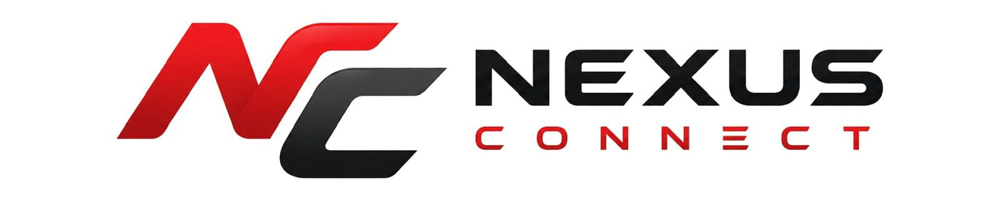

  

# Aion 2.7 Emulator - Nexus Connect Edition

This project is for people who are looking for a rock-solid, old-school emulator for Aion 2.7. It is based on the classic Aion Lightning 2.7 foundation but has been completely revitalized by team **Nexus Connect**.

We are actively updating and maintaining this emulator on a regular basis to support our ongoing project at **[weplaynexus.com](https://weplaynexus.com)**, a dedicated gaming portal.

If you played on the classic old-school servers and think you can build an even better place to play Aion 2.7, please feel free to download this emulator, install it on your own server, and try to satisfy this truly unique community! 😊

**Please NOTE:** The Nexus Connect team is actively monitoring this repository. Show us this project interests you by starring ⭐ and forking it. We will answer your issues and requests. Show us your support, and we’ll show you that we are continuously working on it!

---

## 🚀 Migration & Update Changelog

Here is a detailed breakdown of the development work carried out by **Nexus Connect** to bring this classic emulator into the modern era:

### Aion 2.7 Java 6 → Java 25 Migration
* **Version:** Java 25 Production Build
* **Status:** Stable / Production Ready

#### PHASE 1 - Maven & Java 25 Migration
*  Migrated Java 6 → Java 25
*  Converted Ant project → Maven Multi-Module
*  Created Parent POM structure
*  Commons module migrated
*  Chat Server migrated
*  Login Server migrated
*  Game Server migrated
*  Full project build successful

#### PHASE 2 - Dependency Modernization
*  Upgraded Apache Commons Lang
*  Upgraded Google Guava
*  Upgraded Quartz Scheduler
*  Removed legacy JLine
*  Dependency cleanup and compatibility fixes

#### PHASE 3 - Performance Modernization
*  HikariCP integration & tuning
*  Modern ExecutorService implementation
*  **Java 25 Virtual Threads integration** (Massive concurrency improvement!)
*  ThreadPool modernization
*  Concurrent Collections cleanup
*  Scheduler improvements
*  Shared collection synchronization improvements

#### PHASE 4 - Java 25 Cleanup
*  Implicit cast warnings fixed
*  Redundant cast warnings fixed
*  Switch fall-through warnings fixed
*  Deprecated API cleanup
*  Java 25 compiler compatibility improvements

### 📦 Build Status
* **Commons:** Build OK / Running OK
* **Chat Server:** Build OK / Running OK
* **Login Server:** Build OK / Running OK
* **Game Server:** Build OK / Running OK

> 📝 **Notes:** Remaining compiler warnings are cosmetic Java 25 warnings (`this-escape`, `auxiliary class`, `serializable field`) and do not affect stability, performance, networking, gameplay, or runtime.

### 📌 Current Status Summary
*  Production Ready
*  Java 25 Compatible
*  Maven Multi-Module
*  Stable Runtime

---

## Getting Started

This is what you need to make it work flawlessly. We are providing our own recommended environment where we know the server works correctly. 

> ⚠️ **Note:** We focus our support on the emulator itself. We do not provide standard troubleshooting for basic system environment setup (e.g., general MySQL errors, raw OS-level Java installation issues, etc.).

### Prerequisites

Unlike the old legacy emulators that were stuck in Java 1.6, team Nexus Connect has brought this source into the modern era. This project has been fully upgraded to **JDK 25** for better performance, security, and modern memory management.

To run and build this project, you will need:
* **Java Development Kit (JDK) 25** 
  * You can use [Oracle JDK 25](https://www.oracle.com/java/technologies/downloads/) or [OpenJDK 25](https://jdk.java.net/25/) (or any modern managed flavor like Temurin/Eclipse).
* **A Java Builder / Build Tool**
  * **Maven** (Highly recommended, as the project configuration has been modernized).
* **Database Management System**
  * **MySQL 8.0+** or **MariaDB** (Latest stable versions are recommended and tested).

### Installing

1. **Database Setup:** Execute the provided `.sql` files located in the database folder into your MySQL/MariaDB server to initialize the database structure.
2. **Build the Project:** Run the clean build command via Maven (e.g., `mvn clean package`) directly on your development/hosting machine.
3. **Deployment:** Once the build is successful, navigate to the target output directory, extract the generated server zip files, configure your IP/database credentials, and launch the server using the provided `.bat` (Windows) or `.sh` (Linux) startup scripts.

---

## Contributing & Support

We welcome your help to make this classic emulator even better! If you deploy this emulator and run a server and notice bugs or missing features, your contributions are highly appreciated.

* **How to contribute:** Create a fork of this repository, apply your fixes or features, test your code thoroughly, and submit a **Pull Request**.
* **PR Guidelines:** Please clearly explain what your pull request fixes, optimizes, or adds to the emulator so we can review and merge it smoothly.

### Need Help or Want to Connect?
For more information, project inquiries, or support, feel free to join our official community or contact us directly on Discord:
* 🌐 **Official Website:** [weplaynexus.com](https://weplaynexus.com)
* 💬 **Discord Server:** [Join Nexus Connect Discord](https://discord.gg/HAYber3VYZ)
* 👤 **Direct Discord Contacts:** `zyvelle44_81620` & `nexusconnect`

---

## Authors and Contributors

### The Modernization Team
* **Nexus Connect** - *Current main maintainers, upgraded source code to JDK 25, and optimized core performance for the WePlayNexus gaming portal.*
  * Contact: Discord (`zyvelle44_81620` / `nexusconnect`) | Server: [Discord Link](https://discord.gg/HAYber3VYZ)

### Original Legacy Contributors (Before GitHub Transition)
* **Aion Lightning** - *Initial release*
* **Ferosia** - *First commits and patches*
* **Metos** - *Hard work to make it working*
* **Crysis** - *Hard work to make Metos working*
* **Seita** & **Krunchy** - *Hard work to make it beautiful*
* **Keiryu** - *Hard work to make it unique*

---

## License

Please review the license instructions included in the source files of this project. 

Team Nexus Connect strongly believes that open-source is the future of coding. We would love to grow a collaborative community emulator. Forget the old "I don't want to share my work" mindset—add your own amazing content, share it back with the community, and let's keep the classic Aion 2.7 era alive and well! Be respectful of the hard work done by others, and don't hesitate to report issues when you find them.
